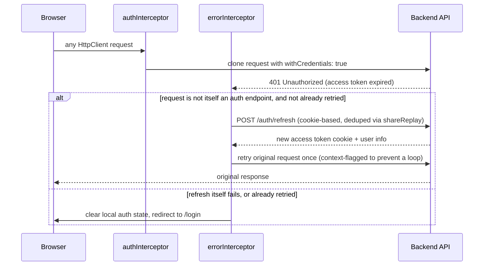

[← Back to README](../README.md)

# Architecture

```
src/app/
  layouts/           Header (navbar, admin dropdown, session badge) and Footer, wraps every route via app.html
  pages/             One folder per route: login, register, simulation, admin/{users,bam-parameters,credit-rates,mourabaha-parameters,audit-log}
  core/
    guards/            Functional route guards: authGuard, guestGuard, managerGuard
    interceptors/      Functional HTTP interceptors: authInterceptor, errorInterceptor
    services/          One folder per domain: auth, token, user, simulation, bam-parameters, credit-rate, mourabaha-parameters, audit-log
    models/            TypeScript interfaces/types mirroring the backend's request/response DTOs
    utils/             http-error.handler.ts, shared HttpErrorResponse logging helper
  shared/
    components/        error-message, loading-spinner: dumb, reused across every page
    validators/        password-complexity.validator.ts, one Angular reactive-forms validator
  app.config.ts       Application-wide providers: router, HttpClient + interceptors, APP_INITIALIZER
  app.routes.ts       Route table: guards, eager vs lazy loading
src/environments/     apiUrl + production flag per build configuration (dev / staging / production)
e2e/                  Playwright specs, one file per backend controller domain (see docs/testing.md)
tools/                preview-server.mjs (prod-like static server for Lighthouse/ZAP), purge-css.mjs, generate-images.mjs
```

Dependency direction is strictly inward: `pages/` and `layouts/` depend on `core/` and `shared/`;
`core/` never imports from `pages/` or `layouts/`. Services never import components. This mirrors
the backend's own "no layer imports from a layer above it" rule, adapted to a component-tree
architecture instead of a request-pipeline one.

## Angular architecture conventions

| Convention | Where | Why |
|---|---|---|
| **Standalone components** | Every component (`app.ts`, all of `pages/`, `layouts/`) | Angular 22 default: no `NgModule` anywhere in the app; each component declares its own `imports: []` |
| **Signals for local/session state** | `TokenService` (`_username`, `_role`), every page's `loading`/`errorMessage`/`result` state | Fine-grained reactivity without `Zone.js`-driven change detection guesswork; `computed()` derives `isAuthenticated`/`isManager` in `HeaderComponent` straight from `TokenService` |
| **Functional guards** (`CanActivateFn`) | `core/guards/*.guard.ts` | `authGuard` (must be logged in), `guestGuard` (must **not** be logged in, blocks `/login`/`/register` for an active session), `managerGuard` (must hold the `MANAGER` role); composed on `/admin` as `canActivate: [authGuard, managerGuard]` |
| **Functional interceptors** (`HttpInterceptorFn`) | `core/interceptors/*.interceptor.ts` | Registered in order via `provideHttpClient(withInterceptors([authInterceptor, errorInterceptor]))`; see [Authentication & session flow](#authentication--session-flow) below |
| **Typed Reactive Forms** | Every form (`fb.nonNullable.group({...})`) | Compile-time-typed `FormGroup`s; validators composed from `Validators.*` plus one custom validator (`passwordComplexity`) |
| **Lazy loading by default, one deliberate exception** | `app.routes.ts` | Every route uses `loadComponent()` except `/simulation`, which is eager because it's the landing page: lazy-loading it caused a measured Cumulative Layout Shift (see `docs/testing.md`) |
| **`APP_INITIALIZER` session bootstrap** | `app.config.ts` | Calls `AuthService.initAuthState()` (`GET /auth/me`) once before the app renders, so a page refresh with a valid session cookie restores `TokenService` state instead of flashing a logged-out UI |

## Authentication & session flow

The access/refresh tokens never touch application code; they live in **HttpOnly, SameSite=Strict
cookies** set by the backend, so `TokenService` only ever tracks the *derived* `username`/`role`
signals, never a token value itself (nothing JWT-shaped is reachable from JavaScript, by design,
enforced by a Playwright regression test, see `docs/testing.md`).



Two details worth calling out because they're easy to get wrong and were bugs during development:

- **`GET /auth/me` is exempt from the redirect-on-401 behavior** (`AUTH_URLS_EXEMPT_FROM_REDIRECT`
  in `error.interceptor.ts`). It's the silent bootstrap probe fired by `APP_INITIALIZER` on every
  page load; a normal "you're not logged in" 401 from it must **not** force-redirect an anonymous
  visitor away from a public page like `/simulation`.
- **Refresh calls are deduplicated** (`AuthService.refresh()`, `shareReplay(1)` over an in-flight
  `Observable`): if several requests 401 at once, only one `POST /auth/refresh` is sent; every
  caller shares its result instead of racing the backend's refresh-token rotation.

## HTTP error handling

`core/utils/http-error.handler.ts` centralizes non-auth error logging: every service's `catchError`
routes through `handleHttpError(serviceName, operation)`, which logs to the console in non-production
builds only (gated on `environment.production`) and always re-throws so the calling component's own
`error:` callback can still surface an `ApiError.description` to the user (every page follows the
same `loading` / `errorMessage` signal pair pattern; see any `*.component.ts` under `pages/`).

## Configuration profiles

| Configuration | File | `apiUrl` | Used by |
|---|---|---|---|
| Development | `environment.development.ts` | `http://localhost:8080/api/v1` | `ng serve` / `npm start` |
| Staging | `environment.staging.ts` | `https://staging-api.bladi-credit.ma/api/v1` | `ng build --configuration staging` |
| Production | `environment.ts` | `/api/v1` (same-origin, reverse-proxied to the backend) | `ng build` (default `production` configuration), `npm run preview` |

`angular.json`'s `production` configuration also enables output hashing, script/style/font
minification, and enforces a bundle budget (800 kB warning / 1.2 MB error on the initial chunk).

## Design patterns actually in use

| Pattern | Where | Purpose |
|---|---|---|
| Facade | `AuthService`, `UserService`, `SimulationService`, `BamParametersService`, `CreditRateService`, `MourabahaParametersService`, `AuditLogService` | One typed method per backend endpoint; components never touch `HttpClient` directly |
| Singleton | Every service (`@Injectable({ providedIn: 'root' })`) | One shared instance app-wide, notably `TokenService` holding the single source of truth for session state |
| Chain of Responsibility | `provideHttpClient(withInterceptors([authInterceptor, errorInterceptor]))` | Each interceptor independently forwards or short-circuits the request/response pipeline, in registration order |
| Guard | `core/guards/*.guard.ts` | Angular-specific: a `CanActivateFn` that allows, denies, or redirects navigation before a route's component is created |
| Observer | Angular `signal`/`computed` (`TokenService`, every page's UI state, `HeaderComponent`'s derived `isAuthenticated`/`isManager`) | Templates and computed values react automatically to state changes, no manual subscription bookkeeping |
| Adapter | `core/utils/http-error.handler.ts` | Adapts every service's raw `HttpErrorResponse` into one consistent logging/rethrow shape |

## Build & asset pipeline

- **Self-hosted, no runtime CDN**: `bootstrap`, `bootstrap-icons`, `@fontsource/poppins` are npm
  dependencies bundled by the Angular build, not `<link>` tags to a third party, which removes
  SRI/DAST concerns entirely and keeps the app usable offline in dev.
- **`postbuild` PurgeCSS pass** (`tools/purge-css.mjs`): strips unused Bootstrap CSS after
  `ng build` (see `docs/testing.md` for the size before/after).
- **`tools/preview-server.mjs`**: an Express + Helmet static server standing in for a real
  production deployment (security headers, gzip, a per-request CSP nonce for Angular's own
  component-scoped `<style>` injection): this is the target Lighthouse CI and OWASP ZAP scan
  against, not the `ng serve` dev server.

## Where to go next

- [Application Overview & User Journeys](business-workflow.md): what each screen does, for a
  non-technical reader
- [Testing & Quality Reports](testing.md): how every layer of the test pyramid maps onto this
  architecture, and the reference results for each gate
- Backend: [Credit-Bladi Architecture](../../Credit-Bladi/docs/architecture.md), the API this
  frontend talks to