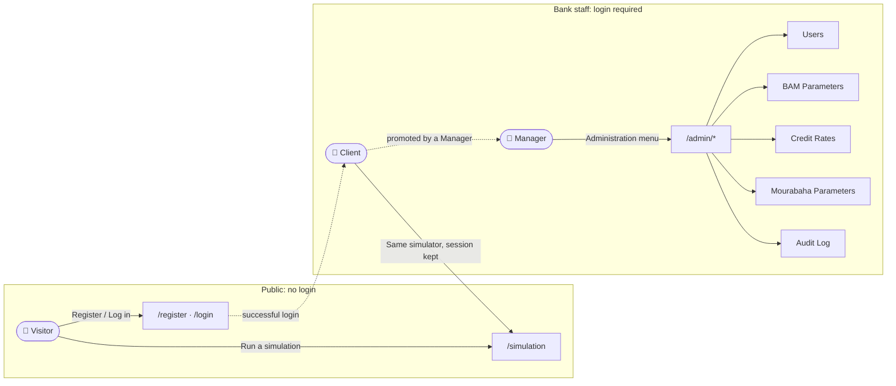

[← Back to README](../README.md) · [User Guide (Annotated Screenshots) →](user-guide/README.md)

# Application Overview & User Journeys (Business Domain)

This document explains **what the portal lets people do**, screen by screen, without technical
jargon, aimed at Product Owners, Scrum Masters, and managers who need to understand *what the
application does*, not how it's coded. It covers the UI's business behavior; the regulatory
calculation rules behind every simulation (BAM eligibility checks, CSP profiles, the two financing
products) are the backend's domain and are documented in detail in the
[Credit-Bladi backend's Simulation Workflow](../../Credit-Bladi/docs/business-workflow.md); this
document assumes that context and focuses on how it surfaces in the portal.

## What this application is

Credit Bladi Portal is the public-facing web application for a Moroccan mortgage credit simulator.
It has two audiences in one app:

- **A public simulator**: the front door. Anyone can estimate a mortgage's monthly cost in one
  form, with zero login and zero friction, exactly mirroring the backend's "no account, no
  paperwork" design.
- **A staff back office**: a restricted area where bank managers adjust the regulatory
  parameters that drive every simulation, manage staff accounts, and review the compliance audit
  trail.

## Who can do what

| Role | Access | Can do |
|---|---|---|
| **Visitor** (not logged in) | Public | Run a mortgage simulation on `/simulation`, register a new account, log in |
| **Client** (logged in, `CLIENT` role) | Authenticated | Everything a Visitor can do, plus stay logged in across visits. No additional screens are unlocked; the simulator itself requires no account by design |
| **Manager** (logged in, `MANAGER` role) | Authenticated + elevated | Everything above, plus the entire **Administration** area: manage staff accounts and roles, edit BAM parameters, edit Conventional credit rates, edit Mourabaha parameters, and browse the audit log |

Registration always creates a `CLIENT` account; a `MANAGER` can only be created, or promoted from
an existing `CLIENT`, by another `MANAGER` from the Users screen (see below). There is no
self-service way to become a manager.

## Screen-by-screen walkthrough

### 1. Simulation (`/simulation`): the landing page

The application's front door; it loads by default at `/` and needs no login. The applicant fills
in a single form and gets an immediate result, with no page reload and no wizard:

- **Loan amount** and **property value**, adjusted with sliders (70,000–30,000,000 MAD and
  80,000–50,000,000 MAD)
- **Duration** in months (12–300), also a slider
- **Financing product**: Conventional (interest-based) or Mourabaha (Sharia-compliant); see the
  backend's [product comparison](../../Credit-Bladi/docs/business-workflow.md#the-two-financing-products)
  for what changes between the two
- **Professional category (CSP)**: Salarié, Fonctionnaire, Retraité, Profession libérale,
  Indépendant, the single biggest lever on the offered rate for Conventional financing
- **Applicant profile**: age, nationality (Moroccan residents only in the current form),
  monthly income, and an optional co-borrower with their own income

Submitting either returns a full cost breakdown (rate, monthly payment, insurance, total cost,
TAEG, one-time fees, and an expandable month-by-month amortization schedule) or a specific
rejection reason surfaced inline; the applicant is never left guessing why they weren't eligible.
Both outcomes are recorded server-side for the compliance audit trail described below.

### 2. Register (`/register`) and Login (`/login`)

Standard account screens, only reachable by someone **not** already logged in (a logged-in visitor
is redirected straight to `/simulation`). Registration asks for a username and a password meeting
a minimum complexity bar; a successful registration redirects to login automatically after a short
confirmation message. Login establishes a session (an HttpOnly cookie, invisible to the page
itself; see [Architecture](architecture.md#authentication--session-flow)) and redirects to
`/simulation`.

### 3. Administration area (`/admin/*`): Manager only

Hidden entirely from the navigation menu, and blocked at the route level, for anyone who isn't
logged in as a Manager. A Client who is logged in but not a Manager is redirected back to
`/simulation` if they try to reach an admin URL directly.

| Screen | Route | What a Manager can do there |
|---|---|---|
| **Users** | `/admin/users` | See every registered account; create a new staff account directly (username, password, role); promote a `CLIENT` to `MANAGER` or demote a `MANAGER` back to `CLIENT` with one click |
| **BAM Parameters** | `/admin/bam-parameters` | Edit the bank-wide regulatory thresholds every simulation is checked against: max debt ratio, minimum deposit (LTV), max age at maturity, insurance rate, processing/registration/notary/land-conservation fee ratios, and whether the parameter set is active |
| **Credit Rates** | `/admin/credit-rates` | Edit the Conventional interest rate range and allowed loan duration range for each professional category (CSP) |
| **Mourabaha Parameters** | `/admin/mourabaha-parameters` | Edit the single bank-wide profit margin rate and VAT rate applied to every Mourabaha simulation, regardless of applicant profile |
| **Audit Log** | `/admin/audit-log` | Browse the compliance trail: who did what, from where (IP address), and when: every simulation outcome and every parameter/user change |

These screens are the UI on top of exactly the regulatory levers the backend documents in
["Why the regulatory parameters are adjustable, not
hardcoded"](../../Credit-Bladi/docs/business-workflow.md#why-the-regulatory-parameters-are-adjustable-not-hardcoded):
a Manager can react to a Bank Al-Maghrib rule change the same day, without waiting for a software
release, and every change they make is itself logged to the same audit trail a simulation outcome
is.

## Why this matters for the business

- **The simulator has zero friction on purpose.** Requiring an account before letting someone see
  a monthly payment estimate would kill the product's entire value proposition as a lead-generation
  front door.
- **Nothing about pricing is hardcoded in the app.** Every number a Manager can see on the
  Administration screens is the actual configuration driving the public simulator in real time:
  changing a rate on `/admin/credit-rates` changes the very next simulation's result.
- **Every consequential action is traceable.** Account creation, role changes, parameter edits, and
  every simulation outcome (accepted or rejected) all flow into the same audit log a Manager can
  review on `/admin/audit-log`; this is what a BAM compliance review or internal audit relies on.