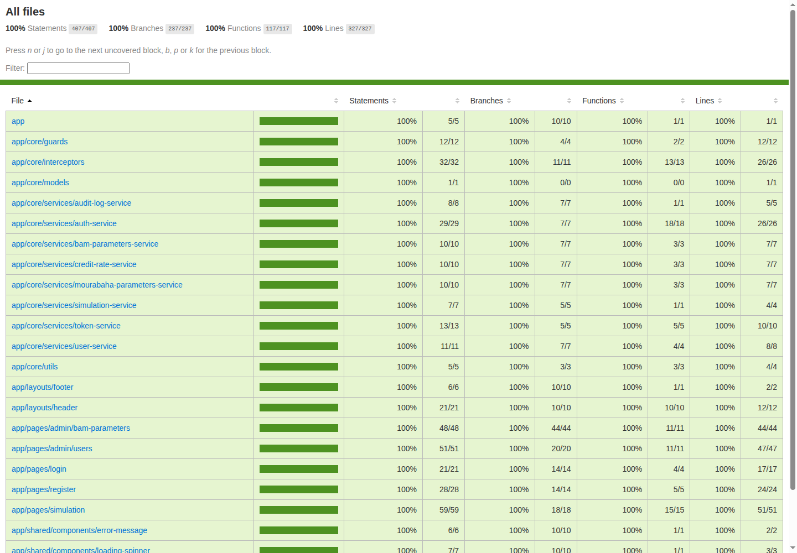
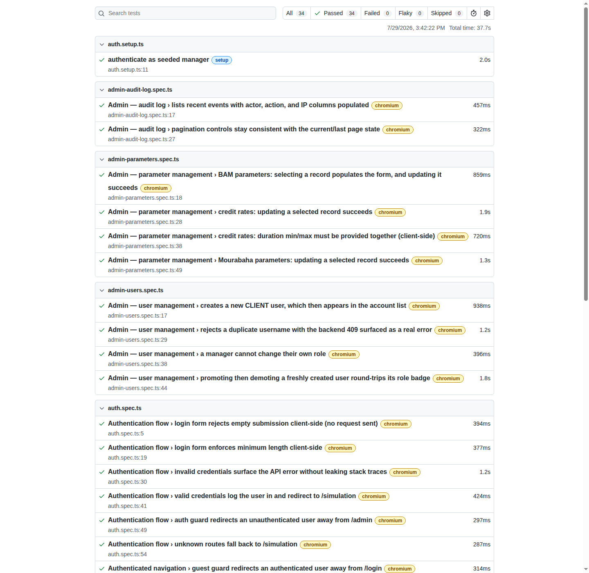
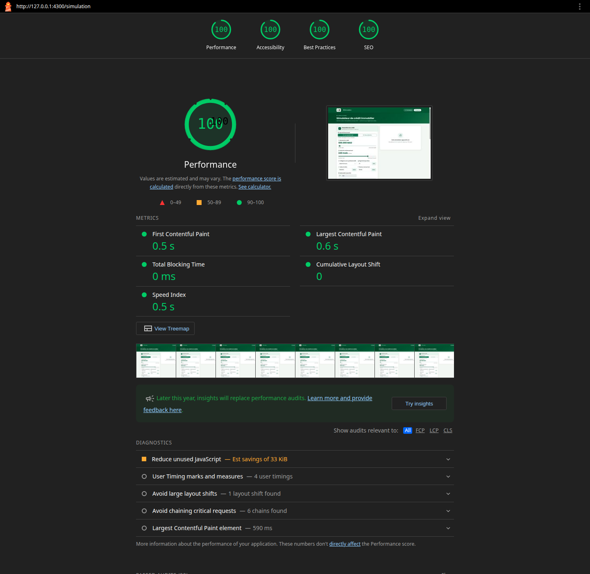
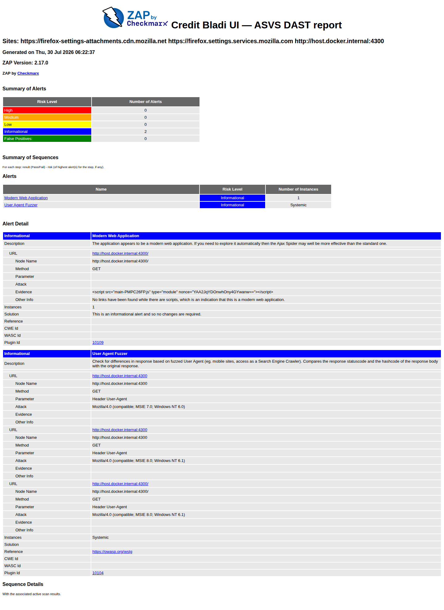

[← Back to README](../README.md)

# Running Tests

```bash
# Unit tests (Vitest, 100% coverage threshold)
npm run test:coverage

# Integration/E2E tests (Playwright)
npm run test:e2e

# Performance tests (Lighthouse CI)
npm run test:perf

# Security: SCA (dependencies), SAST (static analysis), DAST (running app)
npm run test:security:sca
npm run test:security:sast
npm run test:security:dast
```

Playwright's auth-dependent specs and the DAST scan both need the
[Credit-Bladi](../../Credit-Bladi) backend running on `:8080` (`./run-tests.sh` → option 6 in that
repo). `./run-tests.sh` in this repo is an interactive menu wrapping every command above; see the
[README](../README.md#testing) for the full option table.

## Reference Results

| Suite | Command | Result |
|---|---|---|
| Unit tests (Vitest) | `npm run test:coverage` | **180 tests, 23 files, 0 failures** |
| Coverage (V8) | generated by `npm run test:coverage` | **100% statements, branches, functions, lines** |
| Playwright (integration/E2E) | `npm run test:e2e` | **35 tests, 0 failures**, ~36s (backend running) |
| ESLint (style + a11y templates) | `npm run lint` | **0 violations** |
| ESLint (SAST, `eslint-plugin-security`) | `npm run test:security:sast` | **0 violations** |
| audit-ci (SCA, production deps) | `npm run test:security:sca` | **0 high/critical CVEs** (14 production dependencies scanned) |
| Lighthouse CI (performance) | `npm run test:perf` | **99–100 performance, 100 accessibility, 100 best-practices, 100 SEO** on `/` and `/login` |
| OWASP ZAP (DAST) | `npm run test:security:dast` | **0 High, 0 Medium, 0 Low, 1 Informational** |

### Unit tests: coverage report

`coverage/bladi-credit-portal/lcov-report/index.html`, generated by `npm run test:coverage`:



Reading this table:
- **File**: one row per folder under `src/app/`, drilling down to individual files on click.
- **Statements / Branches / Functions / Lines**: the same four V8 coverage dimensions as the
  backend's JaCoCo report, each with its own bar and fraction (e.g. `237/237` branches).
  `angular.json`'s `coverageThresholds` fails the build under 100% on any of the four.
- Every folder sits at 100% across all four dimensions, the same bar the backend holds with JaCoCo.

### Integration/E2E: Playwright report

`playwright-report/index.html`, generated by `npm run test:e2e` (`npx playwright show-report` to
view it):



Reading this report:
- **Top filter bar**: pass/fail/flaky/skipped counts for the whole run. All 35 here, 0 failed,
  when run with the backend up, so the auth-dependent specs (login, register, cookie flags,
  logout, every admin spec) execute instead of skipping.
- **Grouped by spec file**: one per backend controller domain, mirroring
  `Credit-Bladi/src/main/java/com/credit/bladi/controller/`. Every REST endpoint that has a
  corresponding UI action has scenario coverage here:

  | Spec | Backend controller & endpoints | Covers |
  |---|---|---|
  | `auth.setup.ts` | `AuthController`: `POST /auth/login` | One-time manager login, seeds `e2e/.auth/manager.json` for every other spec to reuse (backend login rate limit is 5 req/min/IP; see `AUTH_FILE`'s doc comment in `e2e/helpers.ts`) |
  | `auth.spec.ts` | `AuthController`: `POST /auth/login`, guards | Login/guard flows, validation, redirects |
  | `register.spec.ts` | `AuthController`: `POST /auth/register` | Password complexity, duplicate-username 409, successful registration → redirect to login → the new account can actually log in, guest guard on `/register` |
  | `security.spec.ts` | `AuthController`: `POST /auth/logout`, `GET /auth/me` | XSS, cookie flags, token storage, logout (cross-cutting, not one endpoint) |
  | `simulation.spec.ts` | `SimulationController`: `POST /simulation` | Conventional vs Mourabaha, co-borrower, amortization schedule, a BAM-rejected (422) scenario surfacing a real error, reset, client-side validation |
  | `admin-users.spec.ts` | `UserController`: `GET/POST /users`, `PATCH /users/{id}/role` | Create user, duplicate-username 409, a manager can't change their own role, promote/demote role round-trip |
  | `admin-parameters.spec.ts` | `BamParametersController`, `CreditRateController`, `MourabahaParametersController`: `GET/PATCH .../{id}` | Select-record-then-edit PATCH flow for all three; credit rates' `minDurationMonths`/`maxDurationMonths` must-be-paired validation |
  | `admin-audit-log.spec.ts` | `AuditLogController`: `GET /audit-log` | Read-only paginated list; asserts the very login that seeded this test run is itself a logged entry |

  Every spec mirrors its controller's scenario coverage **at the UI level**: checking the right
  data renders and the right errors surface as real user-facing messages, not duplicating the
  backend's own exact-value assertions (that's what its Karate suite is for; see
  `Credit-Bladi/src/test/java/.../integration/api/v1/*/`). The one endpoint without a dedicated
  E2E scenario is `POST /auth/refresh`: it's an internal silent mechanism triggered by token
  expiry, not a user action, and is covered at the right altitude by
  `error.interceptor.spec.ts` (Vitest) instead of forcing a 15-minute wait in a browser test.
- **Per-test duration**: individual test timing; clicking a row opens the trace viewer (network
  requests, DOM snapshots, console) for that run, the audit trail equivalent of Karate's
  request/response drill-down.
- This suite intentionally runs with `workers: 1` (see `playwright.config.ts`) rather than in
  parallel, for the same rate-limit reason as `auth.setup.ts` above.

### Performance: Lighthouse CI report

`lighthouse-report/*.report.html`, generated by `npm run test:perf` against
`tools/preview-server.mjs`, a real static server over the minified `ng build` output (not
`ng serve`, which is unminified, uncompressed, and has no security headers):



Reading this report:
- **Category rings** (Performance / Accessibility / Best Practices / SEO): 0–100 scores,
  color-coded red (`0–49`) / orange (`50–89`) / green (`90–100`). `lighthouserc.js` gates on
  Performance ≥ 0.85, Accessibility ≥ 0.95, Best Practices ≥ 0.9; the accessibility bar is held
  high deliberately for a banking app.
- **Metrics** (FCP, LCP, TBT, CLS, Speed Index): the Core Web Vitals the score is computed from,
  each flagged red/orange/green against Google's own "good" thresholds. All green here: FCP 0.6s,
  LCP 0.7s, TBT 0ms, CLS 0.
- **Diagnostics**: ranked red/orange/grey list of remaining *opportunities* (e.g. "serve images in
  next-gen formats", "reduce unused CSS/JS") with estimated savings. These don't gate the build on
  their own; the category score above them (Performance: 100) is what the gate checks, but they
  were driven down anyway, not just left as documented debt:
  - **Next-gen image formats / properly size images**: every logo instance now ships through
    `<picture>` with a WebP `<source>` (generated by `tools/generate-images.mjs` from the master
    `public/logo.png`, 536×465) and a PNG fallback. A dedicated `logo-sm` (74×64, 2x for the
    30–37px header/footer badge) replaced the reuse of `logo-md` (368×320) there, which was ~10x
    oversized for that display size. The `/login`/`/register` mobile-only logo (Bootstrap's
    `d-lg-none`, hidden at ≥992px) still got fully *downloaded* on desktop despite being
    `display:none`: CSS visibility doesn't stop a fetch. Fixed with a `<source media="(min-width:
    992px)" srcset="data:image/gif;base64,...">` placeholder ahead of the real image source, so
    `<picture>`'s media-query resolution (which is fetch-aware, unlike `display:none`) skips the
    real download above that breakpoint entirely. The two full-bleed decorative watermarks on
    `/login`/`/register` still use the full-resolution master since they're displayed near that
    size (up to ~560px, close to the 536px source).
  - **Reduce unused CSS**: `tools/purge-css.mjs` runs as an automatic `postbuild` step (fires after
    every `npm run build` via npm's lifecycle hook) and runs the built stylesheet through
    PurgeCSS, scanning the compiled JS output and `src/**/*.html` for every class actually
    referenced. Safe here because nothing in this codebase builds class names dynamically
    (`classList`/`className` string concatenation, `[ngClass]`): every class Bootstrap or our own
    CSS defines is a literal string somewhere in a template. Cut the bundled stylesheet from
    324.6 KiB to 56.1 KiB.
  - **Reduce unused JavaScript / eliminate render-blocking resources**: the only Bootstrap JS
    feature this app used was the admin dropdown (`data-bs-toggle="dropdown"` in
    `header.component.html`); the mobile nav collapse was already hand-rolled with an Angular
    signal. Reimplemented the dropdown the same way (`isAdminMenuOpen` signal, a
    `document:click`/`document:keydown.escape` `@HostListener` pair to close it) and dropped
    `bootstrap.bundle.min.js` (Bootstrap JS + Popper) from `angular.json`'s `scripts` entirely,
    for one less blocking script and no more unused JS from a bundle we only used 1/15th of.
    What's left in "unused JavaScript" (~38 KiB) is Angular/RxJS framework code inside the single
    `main.js` bundle that isn't exercised by whichever page Lighthouse is scoring, not a bug,
    just single-bundle framework overhead; chasing it further means route-level code-splitting of
    framework internals, disproportionate to the remaining bytes.
- This run passes its own gate on both `/` and `/login` (99–100/100/100/100). It didn't on the
  first real run: three real, distinct bugs got found and fixed along the way, not just
  threshold-tuning:
  - **CLS was 0.125** (gate 0.1), traced to a real Chrome performance trace (not a Lighthouse
    simulation artifact, confirmed with `--throttling-method=provided`): `/simulation` is the
    landing page (`''` redirects here) but was `loadComponent`-lazy-loaded, so `<main>` rendered
    empty for one frame and then grew once the chunk arrived, shoving the footer down. Fixed by
    loading it eagerly (`app.routes.ts`); lazy-loading stays for the secondary routes (admin,
    login, register) nobody hits on first paint.
  - **Accessibility was 0.82–0.93** (gate 0.95): `label-has-associated-control` (labels not wired
    to inputs via `for`/`id`, 19 ESLint errors), unlabeled icon-only buttons, and text under the
    WCAG 4.5:1 contrast minimum (`--cb-text-light`, and several `rgba(255,255,255,0.5–0.6)` on
    dark green backgrounds), all fixed in the templates/CSS.
  - **SEO was 0.83**: missing `<meta name="description">` and no `robots.txt`, both added.
  - Performance itself only reached 99–100 after switching Lighthouse's target from `ng serve`
    (dev server: unminified, no compression) to `tools/preview-server.mjs` (real `ng build` output,
    gzip, cache headers) and disabling Angular's `inlineCritical` CSS optimization, which was
    incompatible with the strict CSP below (its async-CSS-swap trick relies on an inline
    `onload="..."` handler that `script-src-attr 'none'` blocks).

### Security · SCA: audit-ci

No HTML report (console/JSON only, like the backend's Checkstyle). `npm run test:security:sca`
runs `audit-ci --config audit-ci.jsonc`, which wraps `npm audit --omit=dev` and fails on any
high/critical CVE:

```
NPM audit report summary:
{
  "vulnerabilities": { "info": 0, "low": 0, "moderate": 0, "high": 0, "critical": 0, "total": 0 },
  "dependencies": { "prod": 14, "dev": 1006, "optional": 135, "peer": 1, "peerOptional": 0, "total": 1020 }
}
Passed npm security audit.
```

`--skip-dev` is deliberate: a plain `npm audit` on this project reports findings in
devDependencies that never reach the shipped bundle (transitive deps of `@lhci/cli` and
`@angular/cli`'s own tooling). Gating a release on risk that was never deployable would just train
people to ignore the gate.

### Security · SAST: eslint-plugin-security

Also console-only. `npm run test:security:sast` runs ESLint scoped to `**/*.ts` with
`eslint-plugin-security`'s recommended rules (`detect-eval-with-expression`,
`detect-non-literal-regexp`, `detect-unsafe-regex`, etc.), 0 violations.

### Security · DAST: OWASP ZAP

`security/zap-report.html`, generated by `npm run test:security:dast` /
`./security/run-zap-scan.sh` against `tools/preview-server.mjs` (requires Docker):



Reading this report: same structure as the backend's ZAP report (Summary of Alerts by risk level,
Alerts table, Alert Detail with evidence/CWE/WASC IDs per finding); see [the backend's testing
docs](../../Credit-Bladi/docs/testing.md#owasp-zap-dast-scan-report) for how to read it in detail.

The current scan finds **0 High, 0 Medium, 0 Low, 1 Informational**, down from an initial 1
High/3 Medium/2 Low/3 Informational on the first real scan (against `ng serve`, before
`tools/preview-server.mjs` existed). The last Medium (`style-src unsafe-inline`) was closed after
an earlier pass had left it as an accepted tradeoff:

- **High: Path Traversal**, and two Low/Informational findings, were all Vite's dev-server-only
  `/@fs/<path>` endpoint, gone entirely once the scan target moved from `ng serve` to a real
  static server, since that endpoint simply doesn't exist outside of Vite's dev mode.
- **Medium: Sub Resource Integrity Attribute Missing** (2 instances): fixed by self-hosting
  Google Fonts (`@fontsource/poppins`) and Bootstrap Icons (`bootstrap-icons` npm package) instead
  of loading them from CDNs; same-origin assets have no SRI concern at all, which is stronger
  than adding `integrity=` hashes to the CDN links.
- **Medium: CSP Header Not Set**, **Missing Anti-clickjacking Header**, **Low:
  X-Content-Type-Options Header Missing**: fixed by `tools/preview-server.mjs`, which sets a real
  CSP (`default-src 'self'`, `frame-ancestors 'none'`, `object-src 'none'`, etc.), `X-Frame-Options:
  DENY`, and `X-Content-Type-Options: nosniff` via `helmet`, a reference for whatever actually
  hosts `dist/` in production (nginx, a CDN) to replicate.
- **Medium: `CSP: style-src unsafe-inline`**: fixed, from two sources. Every hand-written
  `style="..."` attribute (login/register hero panels, header/footer, simulation toggles/tables,
  admin parameter forms) was moved into that component's own CSS file; the remaining dynamic
  bindings (`[style.--fill]`, `[style.background]`) still work because they go through the CSSOM
  (`element.style.setProperty`), which `style-src` doesn't restrict. Separately, Angular itself
  injects each component's scoped CSS as an inline `<style>` element at runtime, which also needs
  `style-src` permission; `tools/preview-server.mjs` now mints a per-request nonce, stamps it on
  `<app-root ngCspNonce="...">` and into `style-src 'nonce-<value>'`, and Angular copies that nonce
  onto every `<style>` tag it creates. `'unsafe-inline'` is gone from `styleSrc` entirely.
- **Informational: Modern Web Application**: not a finding, just ZAP correctly noting it scanned
  an SPA.

> **Environment note**: the Ajax Spider runs inside the ZAP Docker container and needs to reach
> the preview server across the Docker bridge (`host.docker.internal`), not just the host's own
> `localhost`. `tools/preview-server.mjs` needs `HOST=0.0.0.0` for the container to reach it; use
> that only for this disposable local scan, never for anything long-running or shared.

## Postman

No Postman collection for the frontend; the backend's [`postman/`](../../Credit-Bladi/postman/)
collection already exercises every API endpoint the frontend calls; there's nothing UI-specific to
add on top of it.