[← Back to README](../../README.md) · [Application Overview & User Journeys](../business-workflow.md)

# User Guide (Annotated Screenshots)

This guide walks through every screen of the portal with real screenshots, captured against a live
instance of the app (Angular dev server + the [Credit-Bladi](../../../Credit-Bladi) backend on its
`dev` profile). Nothing here is mocked: every number, every table row, and every audit log entry
below is the actual output of the real business rules described in the backend's
[Simulation Workflow](../../../Credit-Bladi/docs/business-workflow.md) and this portal's
[Application Overview](../business-workflow.md). Use this page to show a new user, tester, or
manager exactly what each scenario looks like end to end before they touch the app themselves.

Every **accepted** and **rejected** simulation input below is taken directly from the backend's own
Karate integration tests
([`simulation.feature`](../../../Credit-Bladi/src/test/java/com/credit/bladi/integration/api/v1/simulation/_post/simulation.feature),
[`simulationErrors.feature`](../../../Credit-Bladi/src/test/java/com/credit/bladi/integration/api/v1/simulation/_post/simulationErrors.feature)),
so every screenshot is reproducible and traceable to a specific test scenario, not a hand-picked
number that happens to look nice.

## Table of Contents

- [1. Visitor: the public simulator](#1-visitor-the-public-simulator)
  - [1.1 Conventional financing: accepted and rejected](#11-conventional-financing-accepted-and-rejected)
  - [1.2 Mourabaha financing: accepted and rejected](#12-mourabaha-financing-accepted-and-rejected)
  - [Rejection reasons at a glance](#rejection-reasons-at-a-glance)
- [2. Creating an account and logging in](#2-creating-an-account-and-logging-in)
- [3. Client: authenticated, same simulator](#3-client-authenticated-same-simulator)
- [4. Manager: the Administration area](#4-manager-the-administration-area)

---

## 1. Visitor: the public simulator

No login needed. This is what `/simulation` looks like by default:

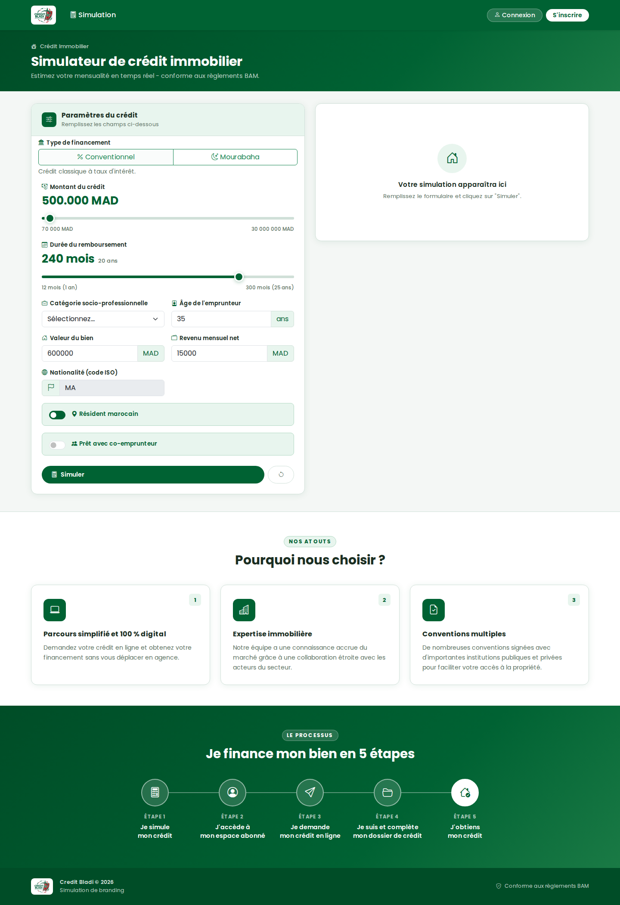

Both products share three BAM eligibility gates, enforced via the exact same `BamParametersModel`
checks in
[`ConventionalFinancingStrategy`](../../../Credit-Bladi/src/main/java/com/credit/bladi/service/simulation/conventional/ConventionalFinancingStrategy.java)
and
[`MourabahaFinancingStrategy`](../../../Credit-Bladi/src/main/java/com/credit/bladi/service/simulation/mourabaha/MourabahaFinancingStrategy.java):

1. **Deposit / LTV**: loan amount must not exceed 90% of the property value
2. **Age at maturity**: age + duration must not exceed the BAM ceiling (75 by default)
3. **Debt ratio**: the resulting monthly payment must not exceed 40% of declared monthly income

**Conventional has a fourth gate that Mourabaha does not enforce: duration in range for the CSP
profile** (e.g. Salarié: 12-240 months, Fonctionnaire: 12-300). This isn't a documentation
simplification; it's a real asymmetry in the backend: `ConventionalFinancingStrategy` looks up the
CSP's `CreditRateModel` and calls `creditRate.getDurationRange().assertContains(duration)` before
anything else, while `MourabahaFinancingStrategy` never touches `ICreditRateRepository` at all (it
only has a `MourabahaParametersModel`, which carries no per-CSP duration bounds). In practice this
means a Salarié requesting 280 months is **rejected** on Conventional but **accepted** on Mourabaha,
bound only by the global 12-300 month range checked at the request level. Worth flagging to the
business owner if that's not an intentional gap.

Any of the gates that do apply failing produces a `422` with a specific, human-readable reason shown
inline on the form; the applicant is never left guessing. All of them are demonstrated below for
**both** financing products, along with the Conventional-only duration gate.

**Which rate is actually used?** The rate range shown in the result (e.g. "5.00% à 5.50%") is just
the CSP's configured bounds for transparency. The single number that drives the debt-ratio check,
the TAEG, and every amortization row (the `applicableRate` in the API response) is picked by a
dedicated per-CSP strategy under
[`conventional/csp/`](../../../Credit-Bladi/src/main/java/com/credit/bladi/service/simulation/conventional/csp):

| CSP | Strategy class | Applicable rate |
|---|---|---|
| Retraité (RETR) | `RetiredStrategy` | `rateMin` (rate range is a single fixed value for this CSP anyway) |
| Fonctionnaire (FONC) | `CivilServantStrategy` | `rateMin` (most favorable) |
| Salarié (SALA) | `EmployeeStrategy` | average of `rateMin` and `rateMax` |
| Profession libérale (PROF) | `ProfessionalStrategy` | `rateMax` (most conservative) |
| Indépendant (INDE) | `FreelancerStrategy` | `rateMax` (most conservative) |

This is why a Fonctionnaire can be **accepted** at a debt ratio that would have failed at their
CSP's `rateMax`; see the regression test scenario in
[`simulation.feature`](../../../Credit-Bladi/src/test/java/com/credit/bladi/integration/api/v1/simulation/_post/simulation.feature#L436).
Mourabaha has no such per-CSP split: every profile uses the single bank-wide profit rate from
[4.4](#44-mourabaha-parameters).

### 1.1 Conventional financing: accepted and rejected

**Accepted**: Salarié (SALA), 35 years old, 800 000 MAD over 240 months against a 1 000 000 MAD
property, 15 000 MAD monthly income. Passes all four gates, so the full cost breakdown appears:
rate range, mensualité, ADI insurance, and the fee breakdown.

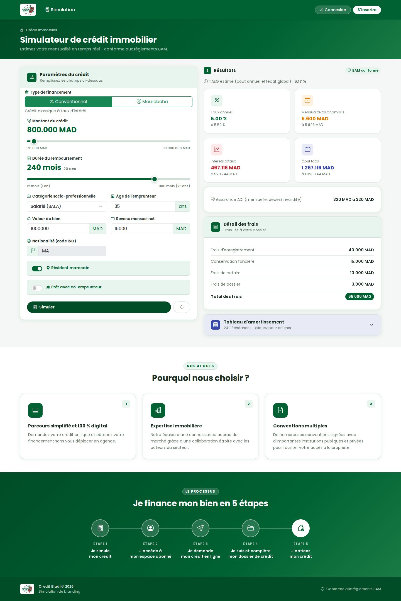

Clicking "Tableau d'amortissement" expands the full month-by-month amortization schedule for that
same simulation:

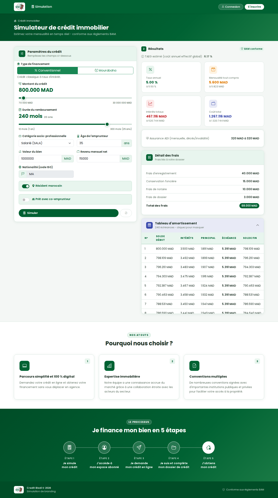

**Rejected: deposit insufficient (LTV).** Indépendant (INDE), 3 000 000 MAD loan against a
3 200 000 MAD property (93.75% LTV, over the 90% ceiling):

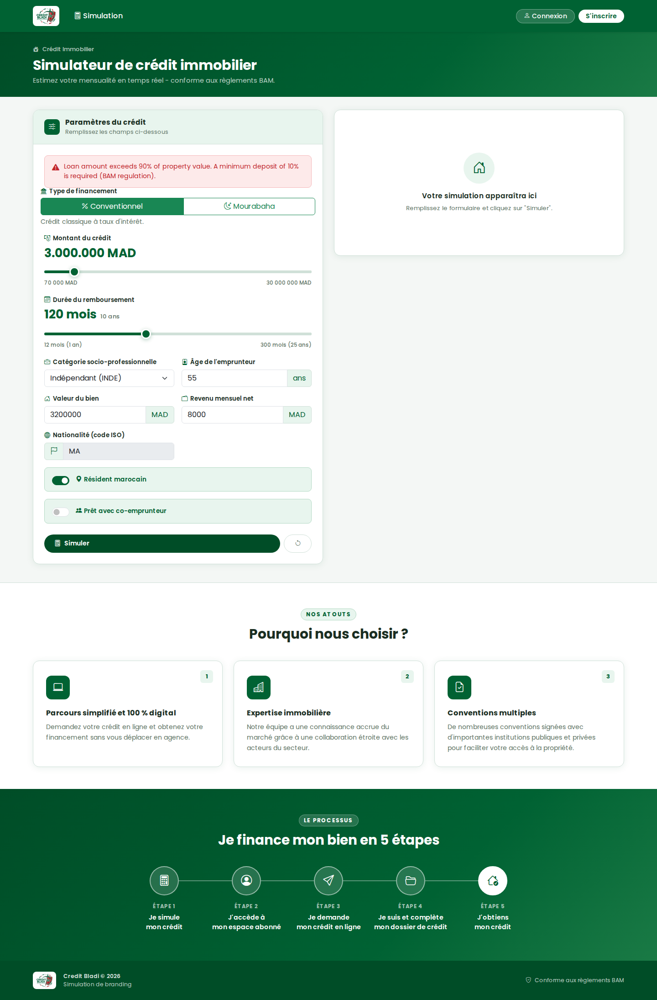

**Rejected: debt ratio exceeded.** Same Salarié profile as the accepted case above, but with
monthly income dropped to 8 000 MAD; the same 5 300 MAD mensualité now exceeds 40% of income:

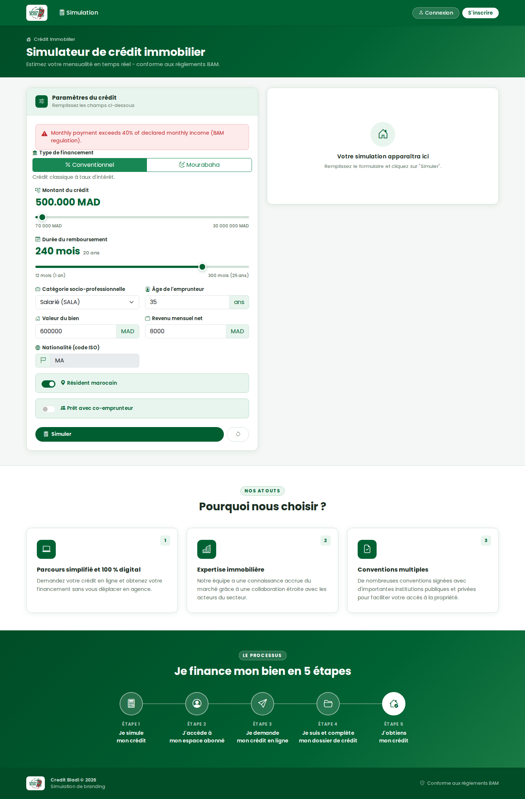

**Rejected: age at maturity exceeded.** Same profile, but the applicant is 60: 60 + 20 years
(240 months) = 80, over the 75-year BAM ceiling:

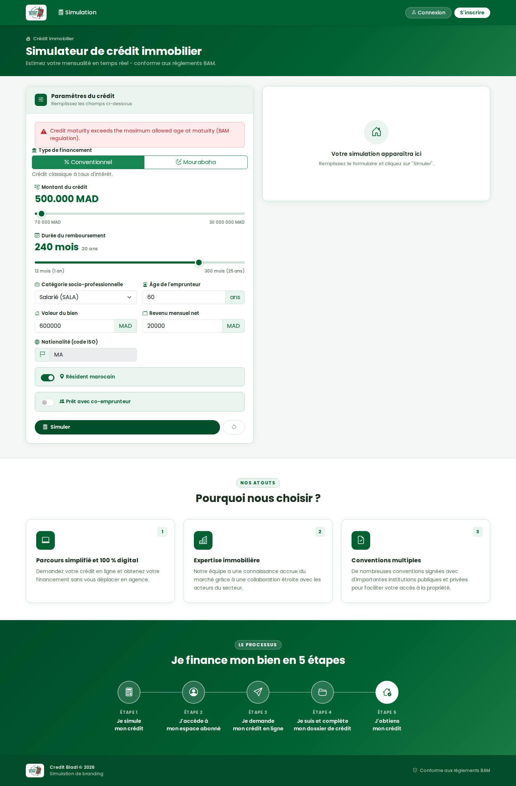

**Rejected: duration out of range for CSP (Conventional only).** Salarié's allowed duration tops
out at 240 months; requesting 241 is rejected before any rate is even looked up. The identical
request on Mourabaha would be **accepted**, since that gate doesn't exist on that code path (see
above):

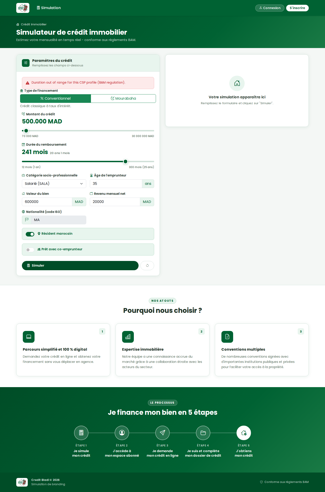

### 1.2 Mourabaha financing: accepted and rejected

Selecting "Mourabaha" switches the result panel to the Sharia-compliant breakdown (profit rate,
marge TTC, TVA) instead of an interest rate. It goes through the same three eligibility gates as
Conventional (LTV, age, debt ratio), but **not** the CSP duration-range gate, as explained above.

**Accepted**: Fonctionnaire (FONC), 700 000 MAD over 240 months, 850 000 MAD property, 18 000 MAD
monthly income:

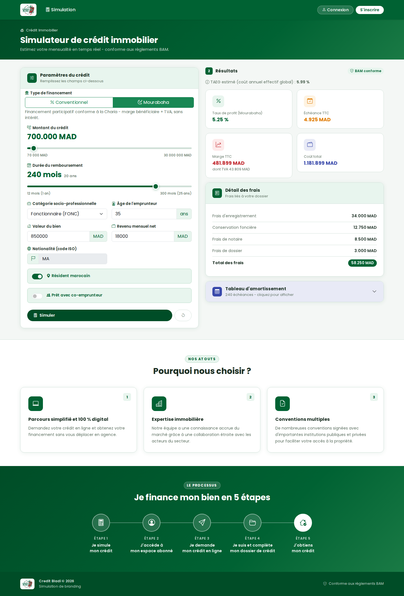

Clicking "Tableau d'amortissement" here shows the Mourabaha-specific schedule columns, Marge HT
and TVA per installment, instead of Conventional's single Intérêts column, since there's no
interest rate involved:

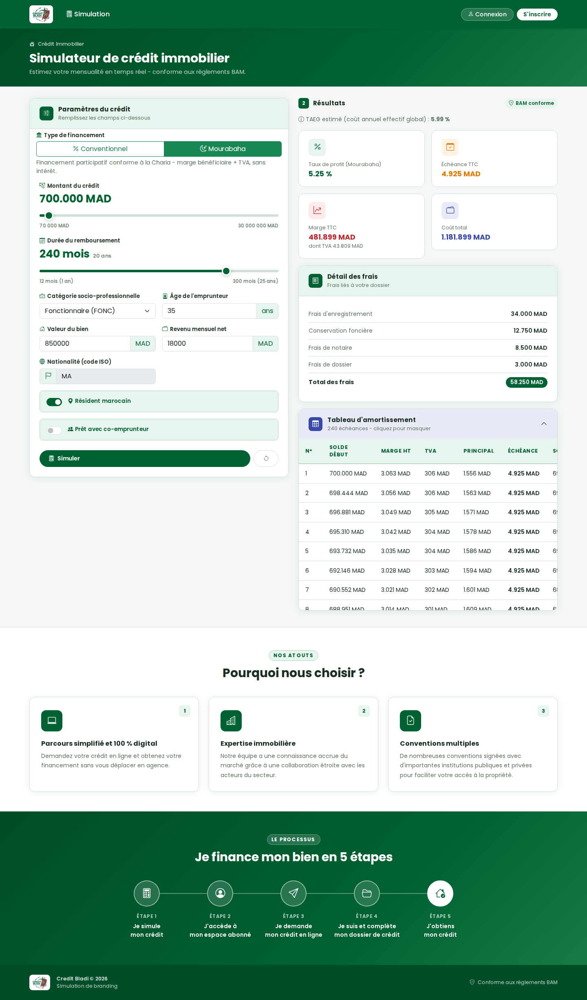

**Rejected: deposit insufficient (LTV).** Same 700 000 MAD loan, property value lowered to
750 000 MAD (93.3% LTV):

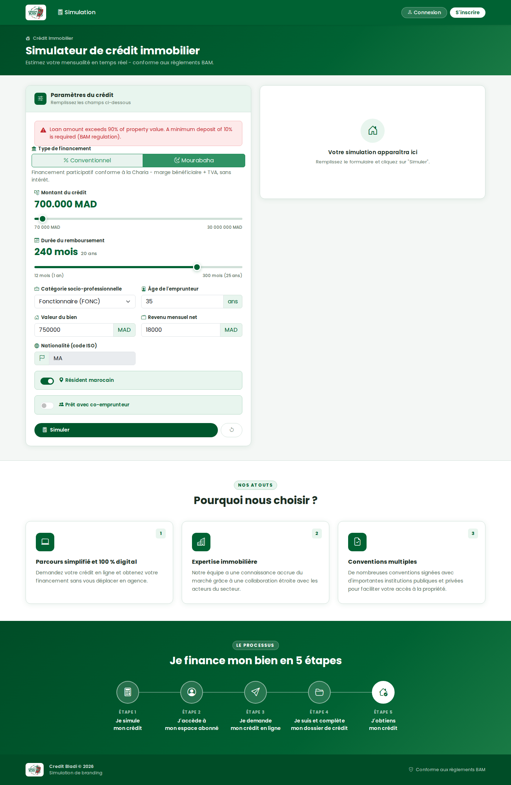

**Rejected: debt ratio exceeded.** Same loan and property, monthly income dropped to 5 000 MAD:

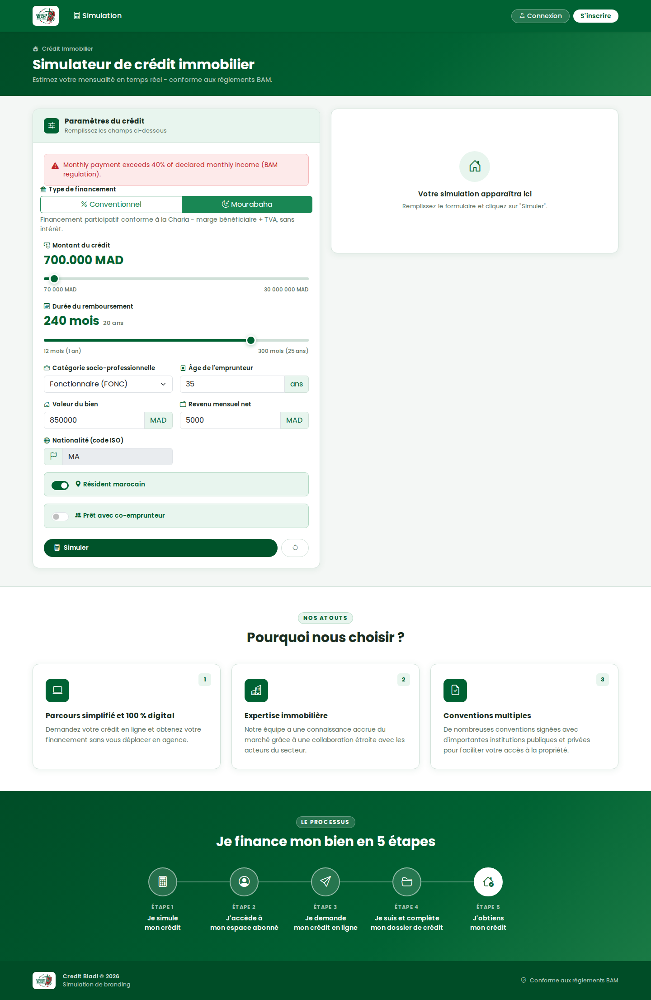

**Rejected: age at maturity exceeded.** Salarié, 500 000 MAD over 240 months, age 60 (same
60 + 20 = 80 > 75 rule as Conventional):

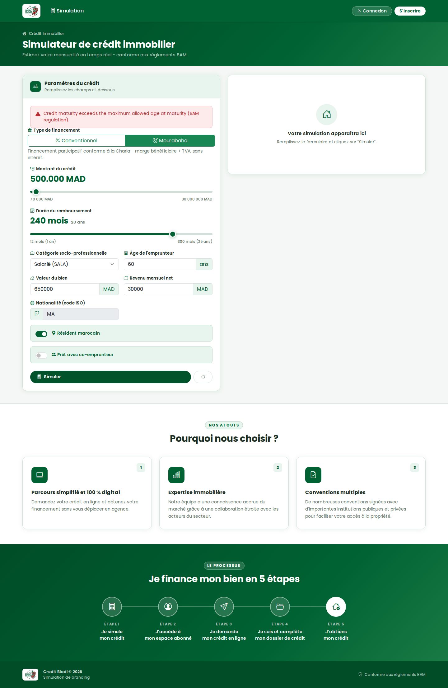

### Rejection reasons at a glance

| BAM rule | Conventional | Mourabaha | Backend rule source |
|---|---|---|---|
| Deposit / LTV > 90% | [screenshot](screenshots/simulation/conventional/03-rejected-deposit-insufficient.png) | [screenshot](screenshots/simulation/mourabaha/03-rejected-deposit-insufficient.png) | `assertWithinLtv`: [`simulationErrors.feature:238`](../../../Credit-Bladi/src/test/java/com/credit/bladi/integration/api/v1/simulation/_post/simulationErrors.feature#L238) |
| Debt ratio > 40% of income | [screenshot](screenshots/simulation/conventional/04-rejected-debt-ratio-exceeded.png) | [screenshot](screenshots/simulation/mourabaha/04-rejected-debt-ratio-exceeded.png) | `assertWithinDebtRatio`: [`simulationErrors.feature:247`](../../../Credit-Bladi/src/test/java/com/credit/bladi/integration/api/v1/simulation/_post/simulationErrors.feature#L247) |
| Age at maturity > BAM ceiling (75) | [screenshot](screenshots/simulation/conventional/05-rejected-age-at-maturity.png) | [screenshot](screenshots/simulation/mourabaha/05-rejected-age-at-maturity.png) | `assertEligibleAge`: [`simulationErrors.feature:219`](../../../Credit-Bladi/src/test/java/com/credit/bladi/integration/api/v1/simulation/_post/simulationErrors.feature#L219) |
| Duration out of range for CSP | [screenshot](screenshots/simulation/conventional/06-rejected-duration-out-of-range.png) | **not enforced**: Mourabaha has no CSP duration gate, only the global 12-300 month bound | CSP duration bounds: [`simulationErrors.feature:170`](../../../Credit-Bladi/src/test/java/com/credit/bladi/integration/api/v1/simulation/_post/simulationErrors.feature#L170) |

Every rejection above is also a `SIMULATION_REJECTED` row in the audit log with the machine-readable
`reason` code (`DEPOSIT_INSUFFICIENT`, `DEBT_RATIO_EXCEEDED`, ...); see [4.5](#45-audit-log).

---

## 2. Creating an account and logging in

Registration and login are only reachable when **not** already logged in ([`guestGuard`](../architecture.md)
redirects an authenticated visitor straight back to `/simulation`).

### 2.1 Register

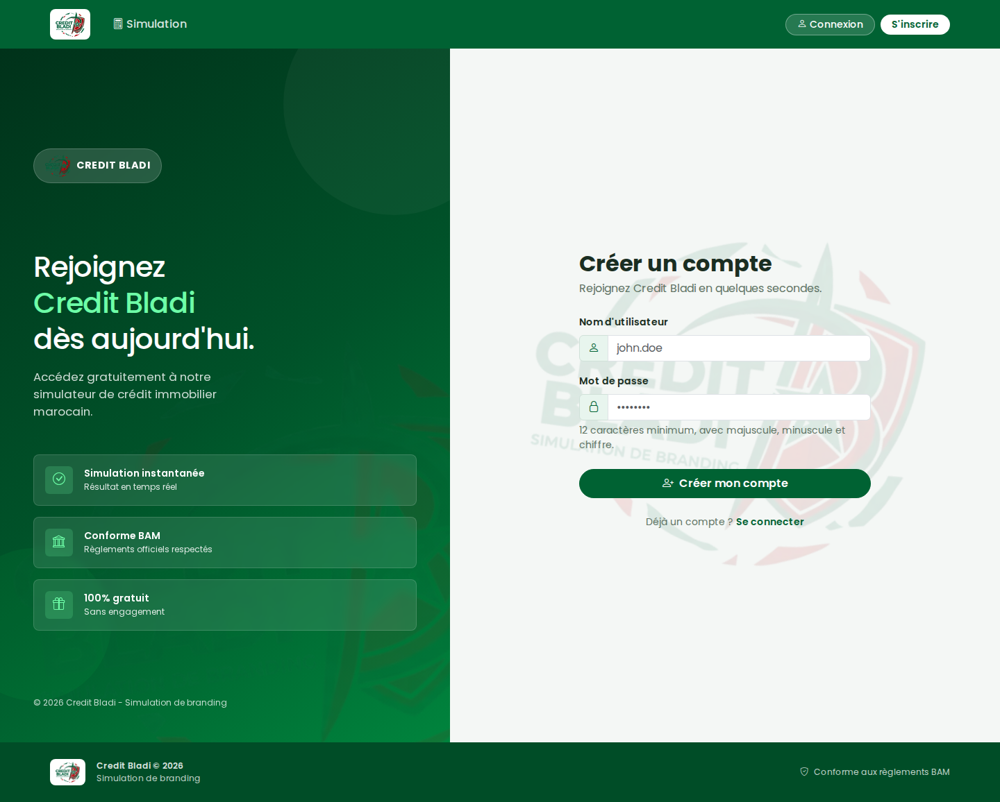

A successful registration always creates a `CLIENT` account and shows a confirmation banner above
the form:

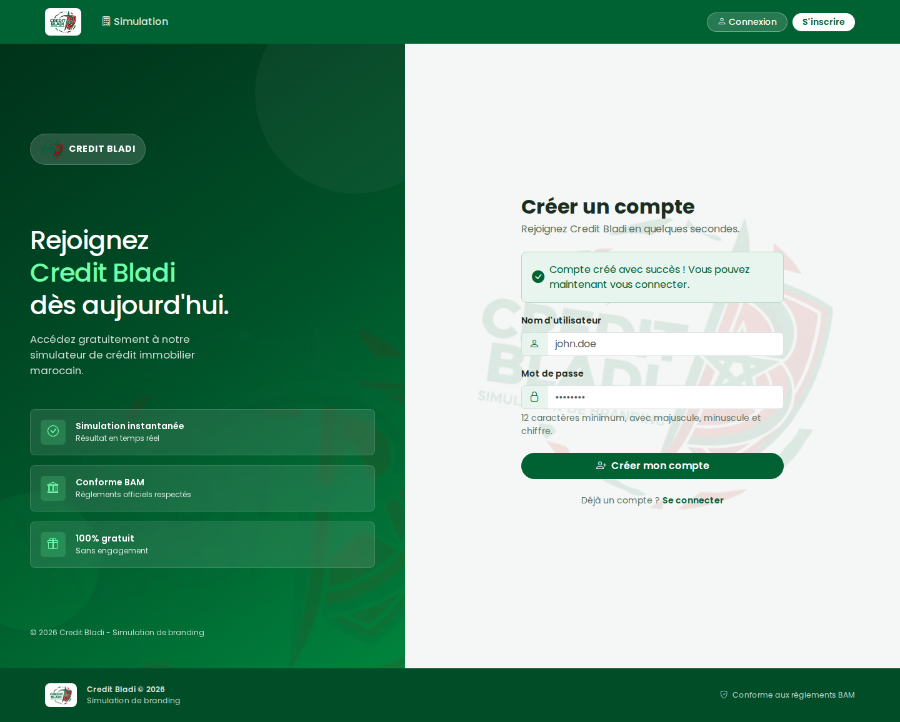

**Rejected: username already taken (409).** Registering with a username that already exists (here,
the seeded `admin` account) surfaces the backend's `CB-409` error inline, same pattern as every other
rejection in this guide:

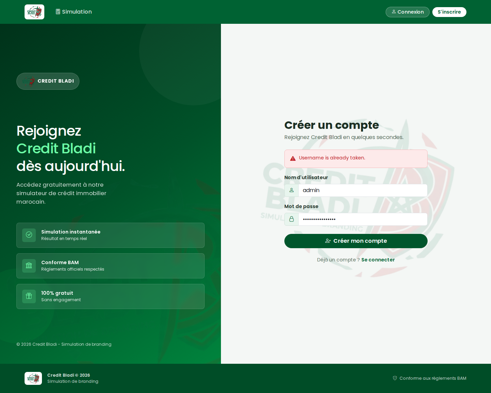

### 2.2 Login

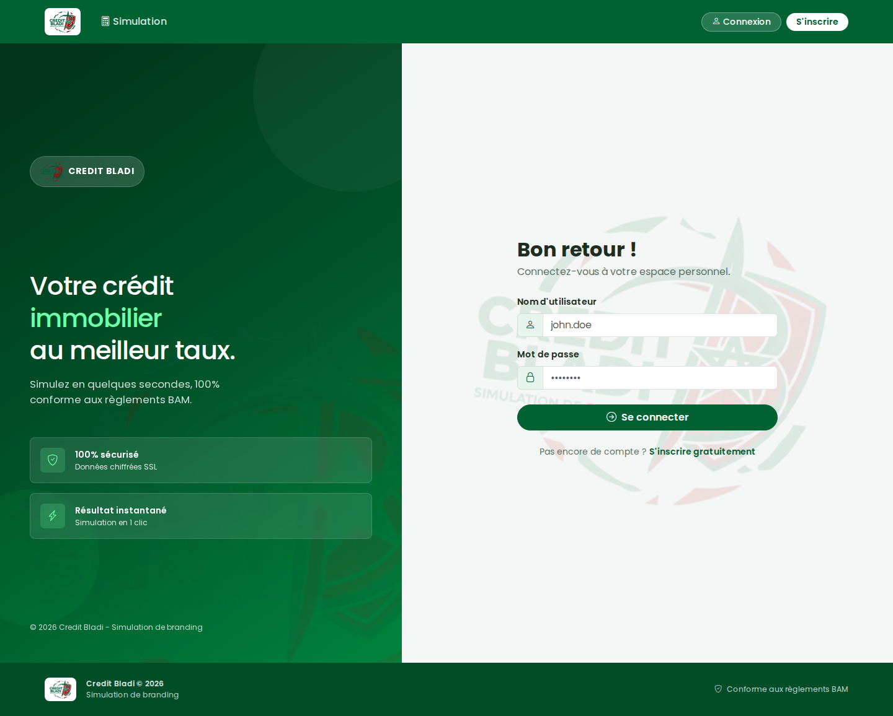

A wrong password (or unknown username, the backend intentionally returns the same generic message
for both, to avoid leaking which usernames exist) surfaces inline, no page reload:

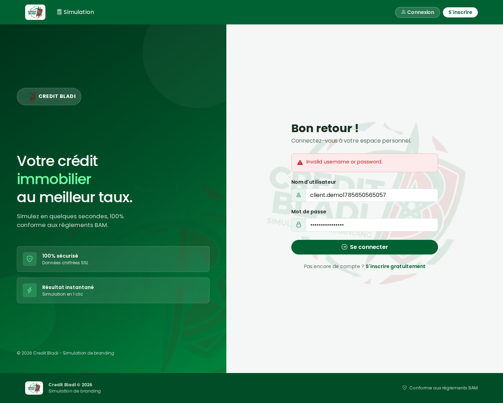

---

## 3. Client: authenticated, same simulator

Logging in with the account created above changes only the header: a username, a `CLIENT` role
badge, and a "Déconnexion" button appear. No new screens unlock; by design, the simulator itself
never required an account (see [why the simulator has zero
friction](../business-workflow.md#why-this-matters-for-the-business)).

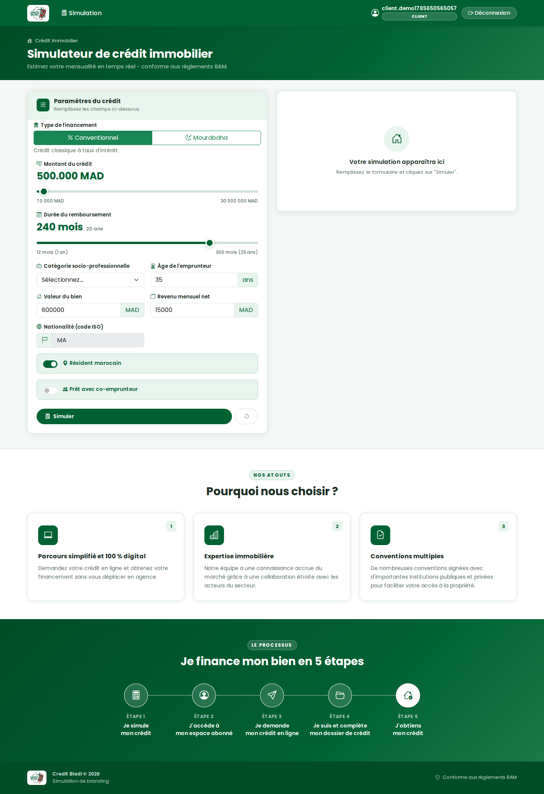

Logging out returns to the anonymous header (Connexion / S'inscrire):

---

## 4. Manager: the Administration area

Logging in as a `MANAGER` (the seeded `admin` account in the `dev` profile) unlocks the
"Administration" dropdown in the header, invisible to Visitors and Clients, and blocked at the
route level for anyone without the role (see
[`managerGuard`](../architecture.md#authentication--session-flow)).

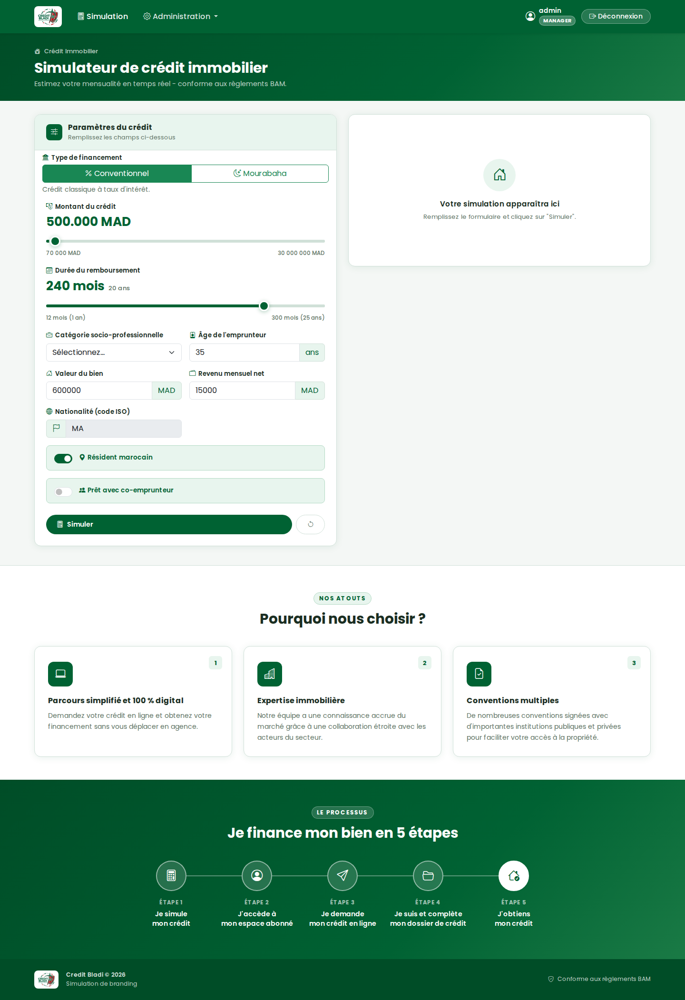

### 4.1 Users

Every registered account, with one-click promote/demote between `CLIENT` and `MANAGER`, and a form
to create a new staff account directly. The `client.demo...` row below is the very account created
in [2.1](#21-register).

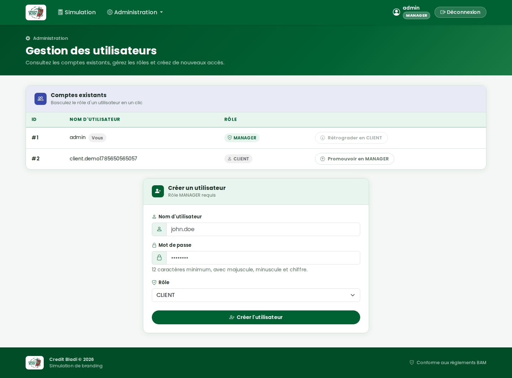

### 4.2 BAM Parameters

The bank-wide regulatory thresholds every simulation is checked against, including the LTV ratio,
max debt ratio, and max age at maturity that produced every rejection in [1.1](#11-conventional-financing-accepted-and-rejected)
and [1.2](#12-mourabaha-financing-accepted-and-rejected).

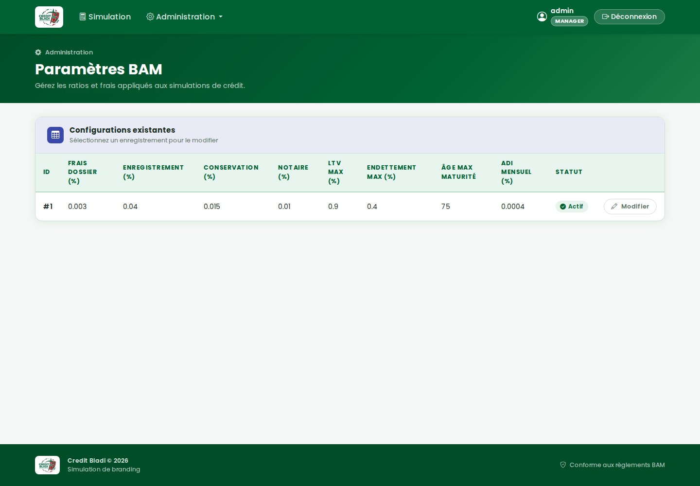

### 4.3 Credit Rates

The Conventional interest rate range and allowed duration range, per professional category (CSP):
this is the exact table that drove the rate in [1.1](#11-conventional-financing-accepted-and-rejected)
and the duration ceiling that produced the rejection in that same section.

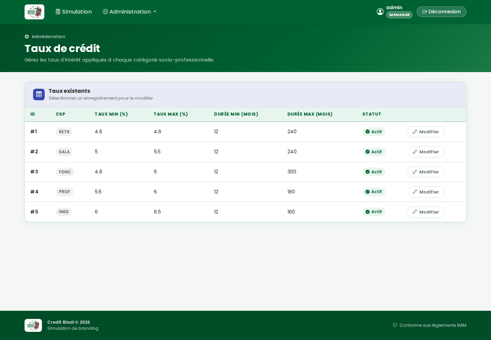

### 4.4 Mourabaha Parameters

The single bank-wide profit margin and VAT rate applied to every Mourabaha simulation, regardless
of applicant profile; drove the result in [1.2](#12-mourabaha-financing-accepted-and-rejected).

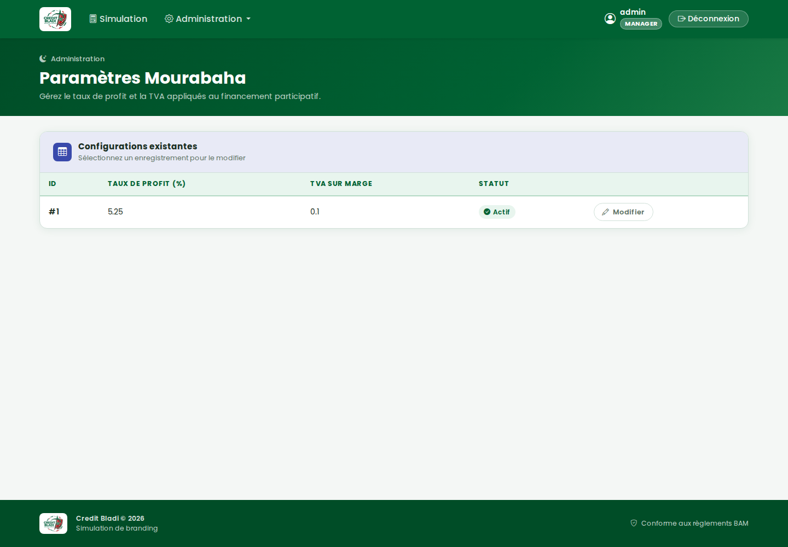

### 4.5 Audit Log

The full compliance trail. Every action performed while capturing this guide is in this exact
table: the registration, duplicate-username error, and failed/successful logins from section 2, the
accepted and every rejected simulation (Conventional and Mourabaha alike) from section 1, and the
client's own login/logout, proving the audit trail records both authenticated and anonymous
activity, tied together by IP address and timestamp.

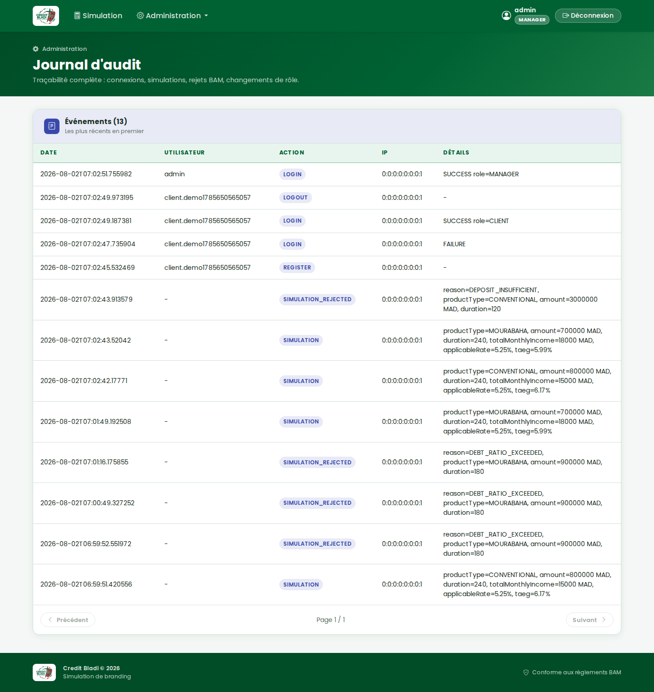

Logging out as Manager returns to the same anonymous header as any other logout:

